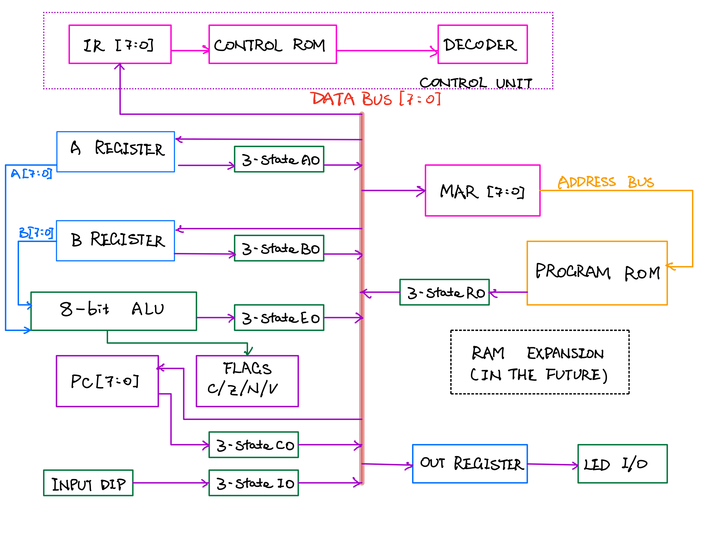

# My 8-bit CPU Learning Project
*Last updated: 2026-09-17*

I started this project because I wanted to understand how a CPU actually runs a program. The idea is to build a simple 8-bit CPU using 74HC / 74HCT logic chips, learning each part as I go.

I am currently working on this project. This repo contains the circuit design, wiring notes, and maybe some small programs in the future. 

## Instruction set

These are the 14 instructions to be implemented.

| Instruction | Bytes | What it does |
|---|---:|---|
| `NOP` | 1 | Do nothing and move to the next instruction. |
| `LDA imm` | 2 | Load the next byte into register A. |
| `LDB imm` | 2 | Load the next byte into register B. |
| `ADD` | 1 | Add A and B, then store the result in A. |
| `SUB` | 1 | Subtract B from A, then store the result in A. |
| `AND` | 1 | Bitwise AND of A and B, stored in A. |
| `OR` | 1 | Bitwise OR of A and B, stored in A. |
| `XOR` | 1 | Bitwise XOR of A and B, stored in A. |
| `IN` | 1 | Read the input switches into A. |
| `OUT` | 1 | Copy A into the output register. |
| `JMP addr` | 2 | Jump to the address in the next byte. |
| `JZ addr` | 2 | Jump if the saved zero flag is 1. |
| `JC addr` | 2 | Jump if the saved carry flag is 1. |
| `HLT` | 1 | Halt the CPU. |

`imm` means an immediate value, stored right after the opcode. `addr` is a program address. 

The CPU is designed to save four flags for the ALU result: **C** (carry), **Z** (zero), **N** (negative/sign), and **V** (signed overflow). 

## Architecture

The CPU uses one shared **8-bit data bus** and a separate **8-bit address bus**. It can address 256 bytes. Each instruction is split into several smaller steps, which is why this is a *multi-cycle* CPU.

Programs are stored in EEPROM (AT28C256). I plan to use an Arduino or another microcontroller as an external
EEPROM programmer to write/read EEPROM via GPIO. The first version I'm working on has no RAM; all working values stay in the registers.

Here is the architecture diagram I'm working on, subject to change over time:

